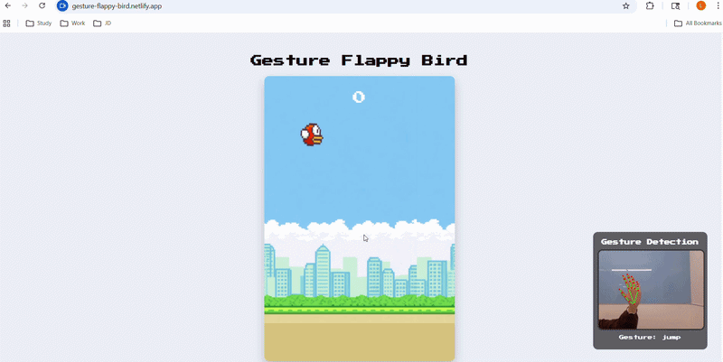

# 🟡 Gesture-Controlled Flappy Bird

## 🎮 Project Description

**Gesture-Controlled Flappy Bird** is a real-time computer vision game that allows users to control a Flappy Bird Game using hand gestures.

By leveraging **MediaPipe for hand tracking** and a **custom-trained PyTorch model**, the system detects user gestures (e.g., *jump* or *idle*) and translates them into in-game actions.

The project demonstrates the integration of **machine learning, real-time video processing, and interactive web applications**.

---

## 🛠️ Technologies Used

### Front-End

* HTML5 Canvas
* JavaScript
* MediaPipe Hands (real-time hand tracking)

### Back-End

* FastAPI
* PyTorch (gesture classification model)

### Machine Learning

* Custom neural network (MLP)
* Landmark-based feature extraction (21 × 3 = 63 inputs)

---

## ✨ Features

### ✋ Real-Time Gesture Recognition

* Uses MediaPipe to detect 21 hand landmarks
* Converts 3D coordinates (x, y, z) into model input
* Sends data to backend for prediction

---

### 🤖 Machine Learning Integration

* Custom-trained PyTorch model
* Classifies gestures into:

  * `idle`
  * `jump`
* Fast inference via REST API

---

### 🎮 Gesture-Controlled Gameplay

* “Jump” gesture triggers bird jump
* Cooldown system prevents rapid repeated triggers
* Smooth interaction between gesture and game mechanics

---

### ⚡ Real-Time Prediction System

* Periodic API requests (~8–15 times per second)
* Optimized balance between responsiveness and performance

---

### 🧪 Custom Dataset Collection

* Built-in data collection mode via keyboard:

  * `1` → collect "jump"
  * `2` → collect "idle"
  * `0` → stop collecting
  * `c` → clear dataset
  * `s` → save dataset as JSON

---

## 🌐 Live Demo

👉 **Play the game online:**  
https://gesture-flappy-bird.netlify.app/

*(Use Google Chrome browser and allow camera access for gesture detection)*

---

## 📸 Demo



---

## ▶️ How to Run

### 1. Clone the repository

```bash
git clone https://github.com/Melissa-Shao/gesture-flappy-bird
cd gesture-flappy-bird
```

---

### 2. Run Backend (FastAPI)

```bash
cd backend
pip install -r requirements.txt
uvicorn main:app --reload
```

---

### 3. Run Frontend

Open `frontend/index.html` using:

* VSCode Live Server (recommended)

---

### 4. Play the Game 🎮

* Allow camera access
* Show your hand in front of the webcam
* Perform gesture to control the bird

---

## 🚀 Future Improvements

* Add more gestures (e.g., crouch, double jump)
* Add confidence threshold to reduce false triggers
* Mobile support (gesture-based controls on phone)

---

## 👤 Author

**Melissa Shao**

[](https://github.com/Melissa-Shao)
